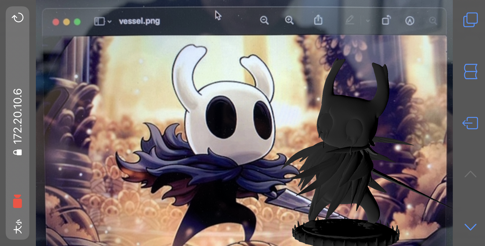

<!-- Title & Logo -->
<h1 align="center">WebAR</h1>

<!-- tag & links (Version\Lang\Package) -->

    

    Source：<a href="https://github.com/evilz0212/ex-ar-webar">Github</a>
	Demo：<a href="https://evilz0212.github.io/ex-ar-webar/">Git Pages</a>

<!-- Overview (Preview\Purpose\Description) -->

## Overview
> 掃描特定圖像，呈現可互動3D模組
#### Target
1. WebAR 圖像追蹤 (Image Tracking)
2. 使用 A-Frame 版本，設定模組互動(一指旋轉\兩指縮放)

#### Detail
-  WebAR：AR.js 圖像追蹤設定、觸發點擊 UI
-  A-Frame：glb 模組屬性設定、燈光設定、互動設定

<!-- Get started (Install\Step) -->
## Get started
#### Demo Steps
1. Open [the website](https://evilz0212.github.io/ex-ar-webar/) on your phone
2. Scan [this image](https://github.com/evilz0212/ex-ar-webar/blob/master/public/vessel.png)

<!-- Partner -->

<!-- License -->

